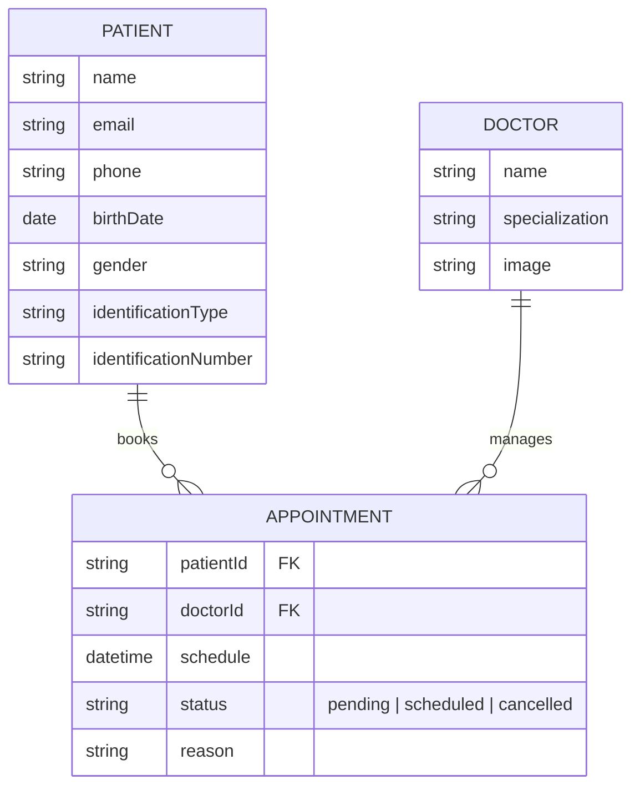

# 🏥 Ayuniya Healthcare System

> A modern, secure, and efficient patient management system built with Next.js and Appwrite.

  

## 📋 Overview

**Ayuniya Healthcare** is a comprehensive web application designed to streamline patient registration, appointment scheduling, and administrative workflows. It leverages the power of **Next.js 15** for a responsive frontend and **Appwrite** for a robust, secure backend.

### Key Features
-   **Patient Registration**: extensive profile management with ID verification.
-   **Appointment Scheduling**: Seamless booking system with doctor selection.
-   **Admin Dashboard**: Centralized view for managing appointments and patients.
-   **SMS Notifications**: Automated updates for appointment status.
-   **Secure File Storage**: Encrypted storage for sensitive identification documents.

## 🛠️ Technology Stack

| Category | Technologies |
| :--- | :--- |
| **Frontend** |     |
| **Backend** |   |
| **Tools** |    |

## 🏗️ Architecture

The application follows a secure Serverless architecture pattern.

```mermaid
graph TD
    User[User (Patient/Admin)] -->|HTTPS| Frontend[Next.js App Router]
    
    subgraph "Secure Server Environment"
        Frontend -->|Server Actions| ServerLayer[API Layer]
        ServerLayer -->|SDK| Auth[Appwrite Auth]
        ServerLayer -->|SDK| DB[Appwrite Database]
        ServerLayer -->|SDK| Storage[Appwrite Storage]
        ServerLayer -->|API| Notification[Twilio/Messaging]
    end
    
    Auth -->|Session| Frontend
    DB -->|JSON Data| Frontend
    Storage -->|File URL| Frontend
```

## 💾 Database Schema

The database is designed with `Patients`, `Appointments`, and `Doctors` as core entities.



## 🚀 Getting Started

Follow these steps to run the project locally.

### Prerequisites
-   Node.js v18+
-   Appwrite Account (Cloud or Self-hosted)

### Installation

1.  **Clone the repo**
    ```bash
    git clone https://github.com/your-username/healthcare-system.git
    cd healthcare-system
    ```

2.  **Install dependencies**
    ```bash
    npm install
    ```

3.  **Setup Environment Variables**
    Create a `.env.local` file:
    ```env
    NEXT_PUBLIC_ENDPOINT=https://cloud.appwrite.io/v1
    PROJECT_ID=your_project_id
    API_KEY=your_api_key
    # ... see docs/setup-guide.md for full list
    ```

4.  **Run the app**
    ```bash
    npm run dev
    ```

## 📂 Documentation

For detailed technical documentation, please refer to the `docs/` directory:

-   [Technical Overview](./docs/technical-overview.md)
-   [Database Schema](./docs/database-schema.md)
-   [Code Review & Patterns](./docs/code-review.md)
-   [Setup & Deployment Guide](./docs/setup-guide.md)

---
*Built with ❤️ by [Chavinda Wijethilake]*
