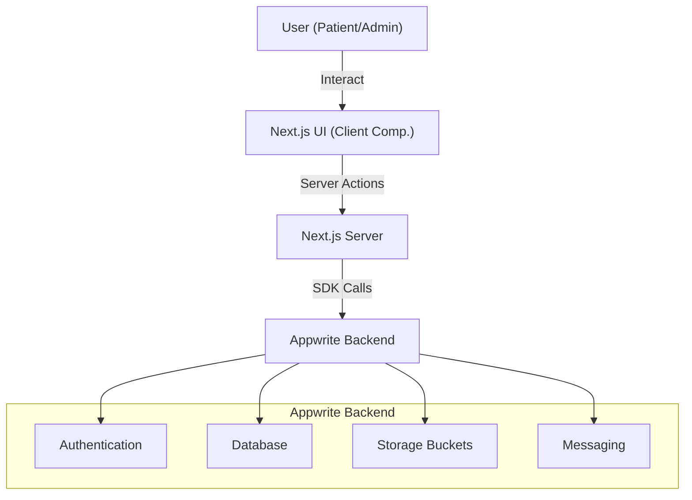

# Technical Overview

## Project Description
The **Healthcare System** (Ayuniya Healthcare) is a patient management application designed to streamline the process of patient registration, appointment scheduling, and administrative management. It provides a user-friendly interface for patients to book appointments and for administrators to manage the workflow.

## Technology Stack

### Frontend & Framework
-   **Next.js 15 (App Router)**: The core framework for building the application, leveraging specific features like Server Components and Server Actions.
-   **React 18**: The library for building the user interface.
-   **TypeScript**: Ensures type safety and improves developer experience.
-   **Tailwind CSS**: A utility-first CSS framework for rapid UI development.
-   **Shadcn/UI**: A collection of re-usable components built with Radix UI and Tailwind CSS.
-   **React Hook Form**: Used for efficient and performant form state management.
-   **Zod**: Schema validation library used for form validation.

### Backend & Services
-   **Appwrite**: An open-source backend-as-a-service (BaaS) that provides the core infrastructure:
    -   **Database**: Stores patient and appointment data.
    -   **Authentication**: Manages user sessions and identity (via Phone/SMS).
    -   **Storage**: Handles file uploads (e.g., patient identification documents).
    -   **Messaging**: Used for sending SMS notifications (via Twilio integration potentially, though mainly Appwrite Messaging).
-   **Sentry**: Application monitoring and error tracking.

### Utilities
-   **libphonenumber-js**: For phone number formatting and validation.
-   **clsx / tailwind-merge**: For conditional class merging.

## Project Architecture

The application follows a modern **Serverless / BaaS architecture** using Next.js Server Actions to interact seamlessly with Appwrite.

## Directory Structure

-   **`src/app`**: Contains the application routes and pages (App Router).
    -   `page.tsx`: Landing page.
    -   `layout.tsx`: Root layout.
    -   `patients/[userId]`: Patient-specific routes (Registration, New Appointment).
    -   `admin/`: Admin dashboard.
-   **`src/components`**: Reusable UI components.
    -   `ui/`: Primitive UI components (buttons, inputs) from shadcn/ui.
    -   `forms/`: Complex form components (PatientForm, AppointmentForm).
-   **`src/lib`**: Global utilities and configurations.
    -   `actions/`: Server Actions for database mutations (`patient.actions.ts`, `appointment.actions.ts`).
    -   `appwrite.config.ts`: Appwrite client and SDK initialization.
    -   `validation.ts`: Zod schemas for form validation.
    -   `utils.ts`: Helper functions.
-   **`types`**: TypeScript type definitions (`index.d.ts`).
-   **`public`**: Static assets like images and icons.
